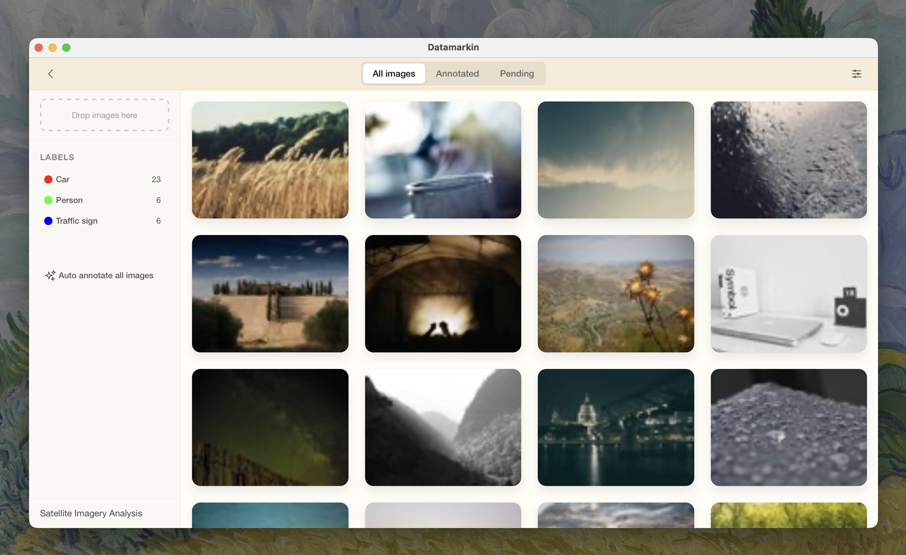

# Datamarkin

A free, local-first desktop platform for the full computer vision workflow.



## Why

Most computer vision platforms are cloud-only and subscription-based. Your images get uploaded to someone else's servers. Your annotations become the platform's training data. You're locked into their ecosystem, paying monthly for something that should run fine on your own machine.

Local computer vision inference is inexpensive. A modern laptop can run capable models without expensive GPUs. For anything sensitive, medical imaging, security footage, proprietary products, your data should never leave your machine.

Datamarkin exists because the full CV workflow (manage, annotate, train, deploy) should be possible locally, offline, and for free.

## What It Is

- Completely free and open-source
- Desktop app — everything runs on your machine
- One platform for the full workflow: manage projects, annotate images, train models, run inference, build workflows
- No accounts, no subscriptions, even no internet required
- Import projects from online platforms

## Features

**Implemented:**

- [x] Project management
- [x] Image gallery
- [x] Label management
- [x] Image annotation workspace with keyboard navigation
- [x] Dataset splitting
- [x] macOS app

**Planned / In Progress:**

- [ ] AI-assisted annotation (SAM2 — box, point, text prompt)
- [ ] Batch auto-annotation
- [ ] COCO JSON export
- [ ] Local model training (Apple Silicon / MPS, GPU)
- [ ] Local inference
- [ ] Workflows / agents
- [ ] Model Zoo
- [ ] Import from cloud
- [ ] Windows & Linux support

## Download

Datamarkin will be available as a downloadable macOS app once the first alpha version is ready. No terminal, no setup, download and run.

If you prefer running from source:

```bash
git clone https://github.com/datamarkin/datamarkin.git
cd datamarkin
conda create -n datamarkin python=3.11
conda activate datamarkin
pip install -r requirements.txt
python main.py
```

## Tech Stack

Simplicity is harder than complexity. It takes more thought to keep things simple than to pile on abstractions. We believe the best tools are built with the least moving parts.

That's why Datamarkin doesn't use React, Next.js, Webpack, Redux, or any of the heavy frontend machinery that most apps reach for by default. No virtual DOM, no state management libraries, no build pipelines, no node_modules. Server-side rendering with Jinja2 does what client-side frameworks do, with less code, fewer bugs, and zero build steps.

| Component | Technology |
|-----------|------------|
| Backend | Flask |
| Desktop window | PyWebView |
| Database | SQLite |
| Templates | Jinja2 |
| Frontend | Vanilla JS |
| CSS framework | Bulma |
| Segmentation | SAM2 |
| Training | PyTorch |

## Contributing

Contributions are welcome. Open an issue or submit a pull request.

## License

Open source. See [LICENSE](LICENSE) for details.
